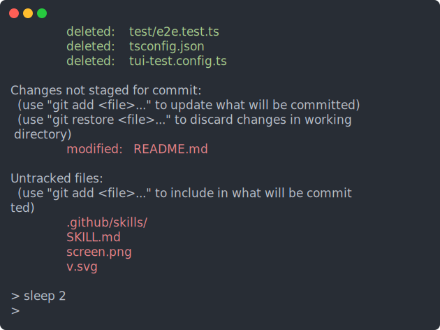

# shell-use

`shell-use` is a rust powered cli for controlling, inspecting, testing, and recording shell sessions and terminal apps. It supports all standard terminal actions (send keys, mouse clicks) & user actions (screenshot, record sessions), & testing (matches screenshot, contains text). `shell-use` supports Windows, Linux, & macOS and it supports a wide range of shells (see [Supported shells](#supported-shells)).

## Install

### install script

macOS / Linux:

```sh
curl --proto '=https' --tlsv1.2 -LsSf https://raw.githubusercontent.com/microsoft/shell-use/main/install/install.sh | sh
```

Windows PowerShell:

```powershell
irm https://raw.githubusercontent.com/microsoft/shell-use/main/install/install.ps1 | iex
```

Use `SHELL_USE_VERSION` to select a specific version or `SHELL_USE_INSTALL_DIR` to select an install location.

### homebrew (macOS/linux)

```sh
brew tap microsoft/shell-use https://github.com/microsoft/shell-use
brew install shell-use
```

### download from releases

Download the latest [release](https://github.com/microsoft/shell-use/releases).

## Quick start

Run a command and check the result:

```sh
shell-use open                  # start a shell session (auto-starts the daemon)
shell-use submit "echo hello"   # type the command, press Enter
shell-use wait command          # block until it finishes
shell-use expect text "hello"   # assert it showed up
shell-use expect exit-code 0    # assert it exited 0
shell-use close
```

Drive a full-screen TUI the same way:

```sh
shell-use run vim file.txt
shell-use wait idle             # let the screen settle
shell-use press i
shell-use type "some text"
shell-use press Escape : w q Enter
shell-use wait exit
```

## Built for agents

`shell-use` is an AI native cli. Point yours at the built-in docs and it can serve itself the rest:

- `shell-use agent-context` prints versioned JSON for every command, flag, enum, default, and exit code. It is generated from the cli, so it cannot drift from the real surface.
- `shell-use usage` prints a one-screen cheatsheet.
- `shell-use skill` prints the full workflow guide ([SKILL.md](SKILL.md)).

### Skill quick start

```sh
shell-use skill --add
```

Adds the `shell-use` skill to the location the user selects in the TUI.

Each command returns a stable exit code (see [Exit codes](#exit-codes)), so an agent can tell an assertion failure from a missing session without scraping text.

## Programmatic usage

`shell-use` has python & node client libraries that drive the daemon with the same commands as the cli. The `shell-use` binary still needs to be on your `PATH` (or pointed to with `SHELL_USE_BIN`). The clients manage the daemon for you, similar to the cli.

### Python ([`shell-use`](bindings/python/README.md))

```sh
pip install shell-use
```

```python
import asyncio
from shell_use import ShellUse

async def main():
    async with ShellUse() as su:
        await su.open()
        await su.submit("echo hello")
        await su.wait_command()
        await su.expect_text("hello")
        await su.expect_exit_code(0)

asyncio.run(main())
```

### Node / Deno / Bun ([`@microsoft/shell-use`](bindings/js/README.md))

```sh
npm install @microsoft/shell-use # Node 20+

bun add @microsoft/shell-use # Bun

deno add npm:@microsoft/shell-use # Deno 2
```

```js
import { ShellUse } from "@microsoft/shell-use";

const su = new ShellUse();
await su.open();
await su.submit("echo hello");
await su.waitCommand();
await su.expectText("hello");
await su.expectExitCode(0);
await su.close();
```

> Note: On Windows, Deno requires all permissions (`-A` / `--allow-all`) instead of just `--allow-read --allow-write` due to the use of named pipes for IPC with the daemon.

## Command reference

Global flags: `--session <name>` (env `SHELL_USE_SESSION`, default `default`), `--json` for machine-readable output, and `--verbose`/`-v` to log PTY traffic (see [Debugging](#debugging)).

### Session & lifecycle

| Command                                                      | Description                                 |
| ------------------------------------------------------------ | ------------------------------------------- |
| `open [--shell S] [--cols N --rows N] [--cwd D] [--env K=V]` | Spawn a shell session.                      |
| `run <program> [args...]`                                    | Spawn a session running a program directly. |
| `sessions`                                                   | List active sessions.                       |
| `close [--all]`                                              | Close the current session (or all).         |
| `daemon status` / `daemon stop`                              | Inspect / stop the daemon.                  |

### Inspection

| Command                                             | Description                                                                                 |
| --------------------------------------------------- | ------------------------------------------------------------------------------------------- |
| `state`                                             | cwd, size, cursor, last command + exit code, text snapshot.                                 |
| `text [--full]`                                     | Plain text of the viewport (or scrollback).                                                 |
| `screenshot [-o file.svg] [--full]`                 | Terminal text to stdout, or a crisp full-color SVG image (svg-term-style window) to a file. |
| `cells X Y [W H]`                                   | Per-cell attributes (char, fg, bg, flags).                                                  |
| `get command\|output\|exit-code\|cwd\|cursor\|size` | Structured getters.                                                                         |

### Input

| Command                                                       | Description                                                  |
| ------------------------------------------------------------- | ------------------------------------------------------------ |
| `type "text"`                                                 | Type literal text.                                           |
| `submit ["text"]`                                             | Type then press the shell return key.                        |
| `press <Key...>`                                              | Named keys, e.g. `press Escape : w q Enter`, `press Ctrl+C`. |
| `keys "Control+a"`                                            | A single key combo.                                          |
| `mouse click X Y` / `mouse click --on-text "OK" [--clicks N]` | Click by coords or label.                                    |
| `mouse move\|down\|up\|drag\|scroll ...`                      | Full mouse control.                                          |

### PTY

| Command                           | Description                      |
| --------------------------------- | -------------------------------- |
| `resize COLS ROWS`                | Resize the PTY and emulator.     |
| `write <data>`                    | Write raw bytes (no return key). |
| `signal INT\|TERM\|KILL` / `kill` | Signal / kill the child.         |

### Wait

| Command                                             | Description                         |
| --------------------------------------------------- | ----------------------------------- |
| `wait text "T" [--regex --full --not --timeout MS]` | Until text is (not) visible.        |
| `wait idle`                                         | Until the screen stops changing.    |
| `wait command`                                      | Until the current command finishes. |
| `wait exit`                                         | Until the session exits.            |

### Expect (exit 0 = pass, 1 = fail)

| Command                                                                         | Description                                |
| ------------------------------------------------------------------------------- | ------------------------------------------ |
| `expect text "T" [--regex --full --no-strict --not --fg C --bg C --timeout MS]` | Visibility + optional color.               |
| `expect exit-code N`                                                            | Last command's exit code.                  |
| `expect output "T" [--regex]`                                                   | Last command's captured output.            |
| `expect snapshot NAME [-u] [--include-colors]`                                  | Compare against `__snapshots__/NAME.snap`. |

Colors accept ANSI-256 (`9`), hex (`#ff0000`), or rgb (`255,0,0`).

### Screenshots

Screenshots render a snapshot of the session in the current terminal by default, but can render an SVG using the `-o` output flag. Nerd Font icons are embedded as vector paths, so SVGs remain self-contained without changing the font stack for regular text.

<p align="center">
  
</p>

### Recording

Every session records automatically from the moment it opens, in the standard
[asciinema v2](https://docs.asciinema.org/manual/asciicast/v2/) cast format.

| Command                   | Description                                     |
| ------------------------- | ----------------------------------------------- |
| `get-recording [session]` | Print the session's recording (cast) to stdout. |

```sh
shell-use get-recording > demo.cast   # capture the current session's recording
asciinema play demo.cast              # replay it
agg demo.cast demo.gif                # render a GIF
```

### Live monitor

Watch a live session in a second terminal while an agent drives it. Both share
the same daemon. `monitor` takes over an alternate screen and streams the
session in full color at ~20fps; press `q`, `Esc`, or `Ctrl-C` to detach.

https://github.com/user-attachments/assets/741c985f-7861-41c5-9ceb-0f82f705b43f

| Command   | Description                                                                       |
| --------- | --------------------------------------------------------------------------------- |
| `monitor` | Attach a live, full-color framed view of the session (`--session` selects which). |

```sh
shell-use --session work monitor   # watch the 'work' session live
```

It needs an interactive terminal (exit `2` otherwise) and an existing session
(exit `3` if none). The view reads only the shared screen state, so watching
never blocks the commands the agent is running, and resizing the window just
re-fits the frame.

### Agents

| Command         | Description                                                                                                                           |
| --------------- | ------------------------------------------------------------------------------------------------------------------------------------- |
| `usage`         | Compact command cheatsheet.                                                                                                           |
| `agent-context` | Versioned JSON describing every command, flag, enum, default, and the exit-code taxonomy (generated from the CLI, so it can't drift). |
| `skill`         | Long-form workflow guide ([SKILL.md](SKILL.md)).                                                                                      |

### Exit codes

Every command returns a stable exit code so an agent can branch on the failure class without parsing text:

| Code | Meaning                                               |
| ---- | ----------------------------------------------------- |
| `0`  | success                                               |
| `1`  | assertion or wait condition not met (`expect`/`wait`) |
| `2`  | usage / invalid argument                              |
| `3`  | no active session (run `open`/`run` first)            |
| `4`  | daemon or IPC error                                   |
| `5`  | internal error                                        |

With `--json`, failures also carry a `"kind"` field (`assertion`/`usage`/`no_session`/`internal`).

## Supported shells

- bash
- zsh
- fish
- PowerShell (`powershell` and `pwsh`)
- xonsh
- elvish
- nushell
- cmd

## Comparison

|                                      | shell-use                                        | [tui-use](https://github.com/onesuper/tui-use) | [terminal-use](https://github.com/flipbit03/terminal-use) |
| ------------------------------------ | ------------------------------------------------ | ---------------------------------------------- | --------------------------------------------------------- |
| Language                             | Rust                                             | TypeScript/Node                                | Rust                                                      |
| Emulator                             | alacritty                                        | xterm (headless)                               | alacritty                                                 |
| Shell command tracking               | ✅ command boundaries, exit codes, cwd           | ❌                                             | ❌                                                        |
| Testing / snapshots                  | ✅ `expect` text / output / exit-code / snapshot | ❌                                             | ❌                                                        |
| Color & per-cell attributes          | ✅ fg/bg, ANSI-256/hex/rgb, `cells`              | ❌ plain text (+ highlights)                   | via PNG                                                   |
| Image screenshots                    | ✅ SVG                                           | ❌                                             | ✅ PNG                                                    |
| Built-in recording                   | ✅ always-on asciinema cast + GIF                | ❌                                             | ❌                                                        |
| Live monitor view                    | ✅                                               | ❌                                             | ✅                                                        |
| Stable exit-code taxonomy for agents | ✅                                               | ❌                                             | ❌                                                        |
| Python & JavaScript bindings         | ✅                                               | ❌                                             | ❌                                                        |
| Runtime                              | native                                           | Node.js                                        | native                                                    |
| Platforms                            | Windows + Unix                                   | Windows + Unix                                 | Linux / macOS                                             |

## Debugging

By default the daemon writes no log. Start it with `--verbose` to record every byte read from and written to the PTY, plus lifecycle events, to `~/.shell-use/<session>.log`.

## Contributing

This project welcomes contributions and suggestions. Most contributions require you to agree to a
Contributor License Agreement (CLA) declaring that you have the right to, and actually do, grant us
the rights to use your contribution. For details, visit https://cla.opensource.microsoft.com.

When you submit a pull request, a CLA bot will automatically determine whether you need to provide
a CLA and decorate the PR appropriately (e.g., status check, comment). Simply follow the instructions
provided by the bot. You will only need to do this once across all repos using our CLA.

This project has adopted the [Microsoft Open Source Code of Conduct](https://opensource.microsoft.com/codeofconduct/).
For more information see the [Code of Conduct FAQ](https://opensource.microsoft.com/codeofconduct/faq/) or
contact [opencode@microsoft.com](mailto:opencode@microsoft.com) with any additional questions or comments.

## Trademarks

This project may contain trademarks or logos for projects, products, or services. Authorized use of Microsoft
trademarks or logos is subject to and must follow
[Microsoft's Trademark & Brand Guidelines](https://www.microsoft.com/en-us/legal/intellectualproperty/trademarks/usage/general).
Use of Microsoft trademarks or logos in modified versions of this project must not cause confusion or imply Microsoft sponsorship.
Any use of third-party trademarks or logos are subject to those third-party's policies.
